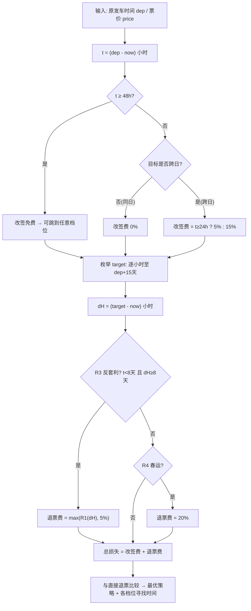

# 火车票「改签·退票 省钱计算器」— 项目交接文档（供 AI 重做 UI）

> 本文档是唯一事实来源。任何 AI 接手做 UI 前，必须完整读完本文档。
> **红线：规则引擎（R1–R8）一个字都不能改。UI 无论怎么重做，算出来的数字必须与本文档公式一致。**

---

## 1. 项目是什么

一个**单文件、零依赖、纯前端**的决策工具（`refund-helper.html`，无构建、无框架、无网络请求）。

它回答一个问题：**「我现在要退这张火车票，怎么做损失最小？」**

核心机制（民间称"改签避费"）：临近开车时退票费档位很高（20%），但**改签是免费/低价的**，且改签后退票费按**新车次发车时间**重新计档——把发车时间推后，档位就降了。

- 直接退票：损失 20%
- 先改签（免费）→ 再退票：损失 10% 或 5%
- 差额就是可省的钱

## 2. 运行方式

双击 `refund-helper.html` 即可（file:// 也能跑）。无任何网络请求、无 API、无密钥。所有规则硬编码在页面的 `RULES` 常量区，来源为 12306 官方公告（2024-01-15 生效，链接见页脚）。

## 3. 规则引擎（完整规格，R1–R8）

引擎只有两个输入：**距原车开车的小时数 `t`**、**改签目标发车时间 `target`**（由此得 `dH` = 距新开车小时数）。

```
R1 退票费档位（按退票时距开车小时数 h）
    h ≥ 192（8天）        → 0%
    48 ≤ h < 192          → 5%
    24 ≤ h < 48           → 10%
    h < 24                → 20%
    金额 = 票价 × 档位%，最低 2 元，以 0.5 元为单位取整

R2 改签费（仅当目标日期 > 原乘车日期，即「跨日改签」时才可能收）
    t ≥ 48h 改签           → 0%（任意目标）
    t < 48h 且目标同日或更早 → 0%
    24 ≤ t < 48 且跨日      → 5% × 票价
    t < 24 且跨日           → 15% × 票价
    基数 = 改签前后较低票价（原型中两票同价，故 = 票价）

R3 反套利条款（官方原文，专为堵本工具的套利而设）
    若 改签时 t < 192h 且 目标 dH ≥ 192h（即「不足8天改签至8天以上」）
    则退票费档位 = max(按R1算出的档位, 5%)   ← 0% 会被抬到 5%
    （若退票时距新开车 < 192h，则正常按 R1 分档，不受此条影响）

R4 春运
    若改签后的乘车日期落在春运期间 → 退票费一律按 20%（R1 全部失效）

R5 金额取整
    退票费/改签费以 0.5 元为单位四舍五入（角位 <2.5角舍去、≥2.5角进到相邻
    的 0.5 元）；退票费最低 2 元

R6 硬性时间约束
    a. 网上退票/改签须在开车前 ≥30 分钟（之后只能到车站窗口）
    b. 改签目标须在预售期内（15 天，自原型验证日起算）
    c. 每张票只能改签一次；改签费一旦收取不退还

R7 开车后
    当日 24:00 前可改签当日其他列车（改签费 40%，基数同 R2）——
    本原型未实现此分支，UI 只覆盖开车前场景

R8 每次用户操作后，一切以重算结果为准（引擎是纯函数，无副作用）
```

**总成本公式（唯一）：**

```
改签路径总损失 = R2改签费(票价, t, 跨日?) + R1退票费(票价, dH, R3修正, R4修正)
直接退票损失   = R1退票费(票价, t)
最优策略 = 枚举 target ∈ [now+30min, 原发车+15天] 逐小时，取总损失最小者
```

## 4. 计算流程图



## 5. 现有原型（`refund-helper.html`）的结构

**UI = 3 个输入 + 1 个结论卡 + 3 个折叠区。** 新 UI 必须保留这 4 类信息，呈现方式随意。

| 区块 | 内容 | 数据来源 |
|---|---|---|
| 输入行 | 原车发车时间（datetime-local）、票价。**当前时间=系统时间，不显示输入框** | 用户输入 |
| 结论卡 | ① 直接退票：损失金额（档位%）② 最优改签策略：改签至 X 时间之后发车 → 改签费+退票费=合计，省多少 | `computeDirect` / `bestChange` |
| 折叠：档位寻找时间 | 三行表：降到 10% / 5% / 0% 各需改签至什么时间下限，标注「同日·免改签费」或「跨日·收改签费」 | 枚举 target=now+24h/48h/192h |
| 折叠：试算 | 用户自选目标时间 → 完整明细（改签费/退票费/合计/对比） | `computeChange` |
| 折叠：规则依据 | R1/R2 表格化 + R3/R4/R5/R6 条款 + 官方链接 | 常量 |

### 现有 JS 函数清单（`refund-helper.html` 内嵌 `<script>`）

| 函数 | 输入 | 输出 | 语义 |
|---|---|---|---|
| `refundPct(h)` | 距开车小时 | 档位 % | R1 |
| `changeFeePct(t, crossDate)` | 距原开车小时、是否跨日 | % | R2 |
| `roundFee(yuan)` | 金额 | 取整后金额 | R5 |
| `computeDirect(now,dep,price)` | — | `{hours,pct,fee}` | 基准 |
| `computeChange(now,dep,price,target,chunyun)` | + 目标时间、春运 | `{chgPct,chgFee,rPct,rFee,total,antiAbuse,onlineOk}` | R2+R1+R3+R4+R6 |
| `findBest(now,dep,price,chunyun)` | — | 最优 target 与明细 | 逐小时枚举 |
| `render()` | — | 重绘全部 | 订阅输入变化 |

## 6. 必须保留的语义（新 UI 的硬约束）

1. **R1–R8 的每个数字、每个档位边界（含"不足"不含本数的语义）不得改动**
2. **不显示/不暗示任何 12306 未公开的规则**；所有档位须能在页面上溯源到官方链接
3. **0% 档必须展示反套利修正后的 5%**，不得展示"改签到8天后退票免费"（这是 2024 年已堵死的旧规则）
4. **改签费与退票费是两项独立损失，必须分别列出再合计**，不得合并成一个百分比
5. **跨日改签必须显式警示改签费**（这是本工具与民间传言的最大差异点）
6. 无法由 R1–R8 得出的项（如"实际执行是否与通知一致"）标注为**待实测**，不伪造结论

## 7. 已知开放问题（供下一轮实测/扩展）

| # | 问题 | 状态 |
|---|---|---|
| 1 | 「改签费 + 退票费」是否真的叠加收取（官方文本未明说"叠加"，按通知原文推断为叠加） | 待实测 |
| 2 | 反套利条款的实际执行（系统是否真按 5% 而非 0% 退） | 待实测 |
| 3 | 跨日改签费按「改签前后较低票价」计——改签到高价车时的精确口径 | 待实测 |
| 4 | 部分来源称免费退票门槛为 15 天（2015 年旧规），官方通知原文为 **8 天**——以通知原文为准 | 已按 8 天实现 |
| 5 | 开车后改签分支（40% 档）未实现，UI 只覆盖开车前 | 范围外 |

## 8. 新 UI 的产品方向（已与用户确认）

- **地图/主路线为中心的视觉**是 RailGo 主项目的方向，但**本工具是独立小工具**——不需要地图，只需要"输入 → 结论"的最短路径
- 交互语义：**用户感觉在和规则引擎对话**（"我现在退亏多少？→ 先改签到 X 再退亏多少？→ 找什么时间的车？"），不是填表
- 动画克制：数字变化要有过渡，不要闪烁；loading 态（如需要）轻量
- 语言：全中文自然语言，禁止 undefined/英文 code/开发者占位词

## 9. 文件与环境

| 文件 | 说明 |
|---|---|
| `refund-helper.html` | 全部实现（HTML+CSS+JS 单文件，约 260 行） |
| 本地服务 | `python -m http.server 8777`（工作区根目录），访问 `/refund-helper.html` |
| 测试 | 无自动化测试；以用户真实购票对照为准（引擎验算样例见 §3 与对话记录） |
| AK 备份 | `../_railgo-backup/config.local.js`（百度 AK，与本工具无关，属 RailGo 主项目） |
